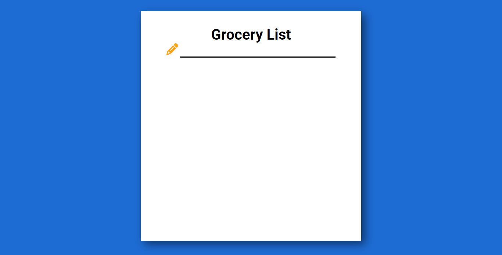
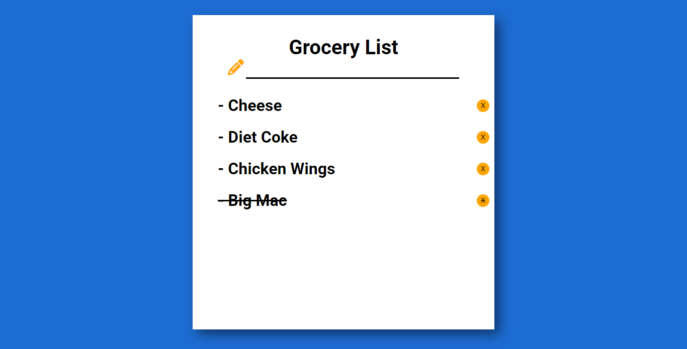

# Grocery List Web App

This is a simple web application that allows users to create and manage their grocery lists. Users can enter their grocery items and keep track of their shopping needs.

## Features

- User-friendly interface for adding grocery items to the list
- Interactive checkboxes to mark completed items
- Ability to delete individual items or clear the entire list
- Responsive design for seamless usage across different devices

## Technologies Used

- HTML
- CSS
- JavaScript

## Getting Started

To use the Grocery List web app locally or deploy it on a web server, follow these steps:

1. Clone the repository to your local machine using the following command:

   ```bash
   git clone https://github.com/DonFranklie/grocery-list.git
   ```

2. Navigate to the project directory:

   ```bash
   cd grocery-list
   ```

3. Open the `index.html` file in a web browser or deploy the project to a web server.

## Screenshots



## Usage

1. Open the web app in your preferred web browser.

2. Enter the grocery item you want to add to the list in the input field and press Enter or click the "Add" button.

3. The item will be added to the list with a checkbox.

4. Check the checkbox next to an item to mark it as completed.

5. To delete an item, click the "X" button next to it.

6. To clear the entire list, click the "Pencil" button.

## Contributing

Contributions are welcome! If you have any suggestions, bug reports, or feature requests, please open an issue on [GitHub](https://github.com/DonFranklie/grocery-list/issues).

## License

This project is licensed under the [MIT License](https://opensource.org/licenses/MIT).

## Contact

For any inquiries or questions, please email me at donfranklie@gmail.com.